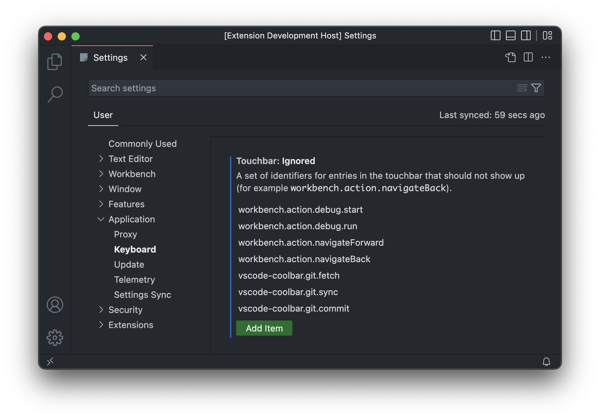

# vscode-coolbar

CoolBar - Good TouchBar VS Code extension for Apple MacBook Pro.

## Features

This extension add some action to your TouchBar.

For now, available this actions:
 - Git panel
   - ⬇️ - Pull
   - ↙️ - Fetch
   - 🔄 - Sync
   - ⬆️ - Push
   - ⏺ - Commit
   - 🔀 - Checkout
   - ⤵️ - Merge

That's how it looks:

### You can hide some buttons you dont want to see

Here is list of all commands to hide if you wish:
 - `vscode-coolbar.git.pull`
 - `vscode-coolbar.git.fetch`
 - `vscode-coolbar.git.sync`
 - `vscode-coolbar.git.push`
 - `vscode-coolbar.git.commit`
 - `vscode-coolbar.git.checkout`
 - `vscode-coolbar.git.merge`

How to hide default VSCode commands:
 - `workbench.action.debug.start`
 - `workbench.action.debug.run`
 - `workbench.action.navigateForward`
 - `workbench.action.navigateBack`

## Contribute

Feel free to fork this repo and add some new features!

Or contact me with your ideas to add!

**Enjoy!**
